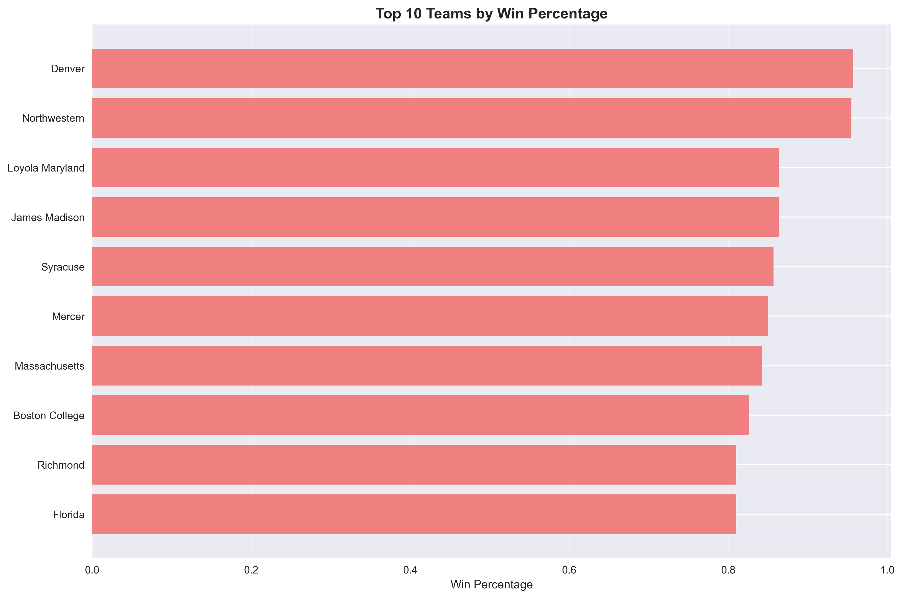
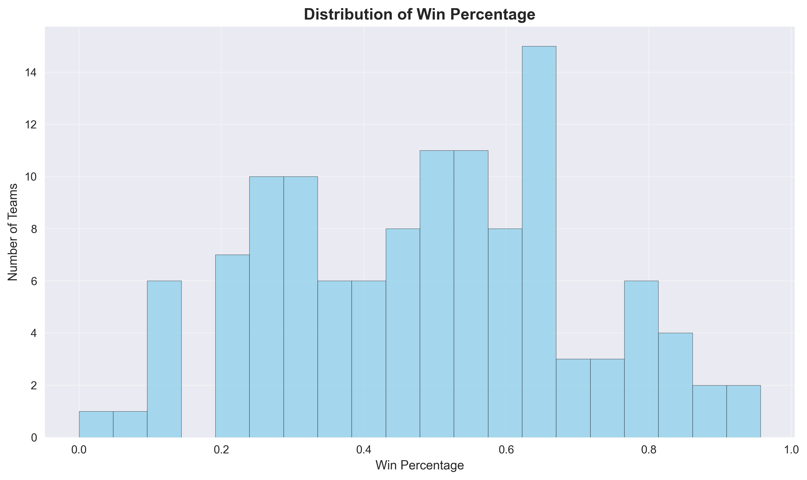
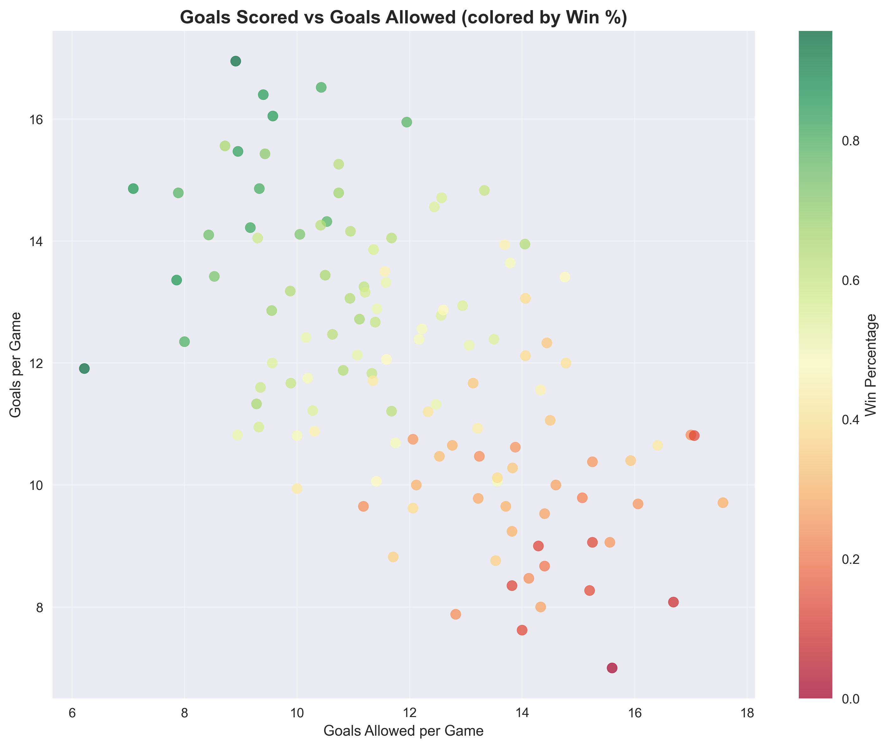
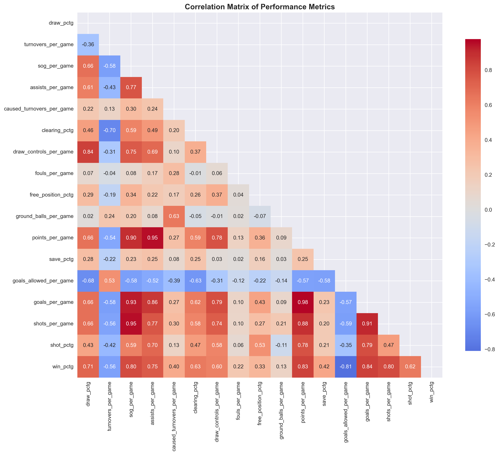
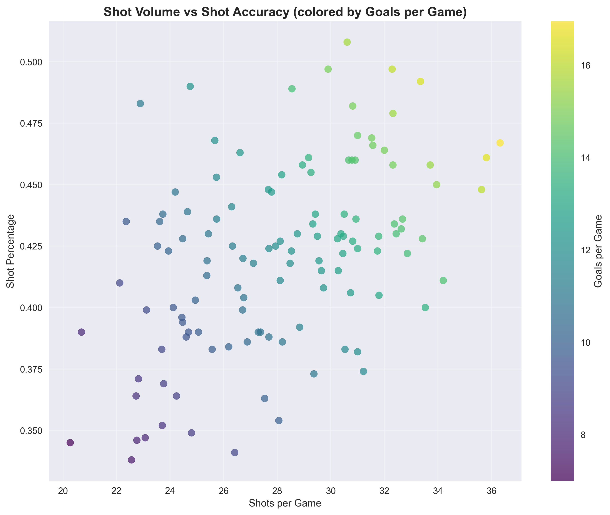
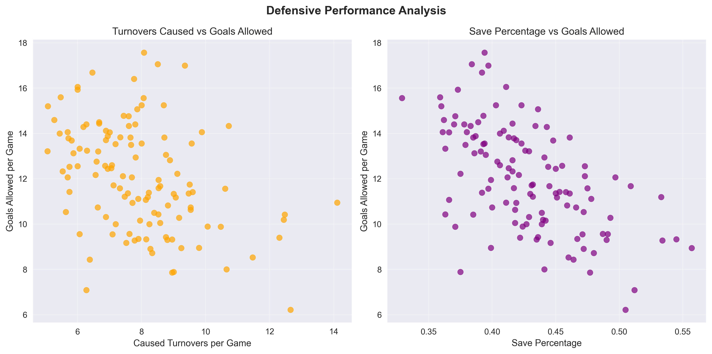

# Research Task 5: Descriptive Statistics and Large Language Models
 
**Dataset:** NCAA Division 1 Women's Lacrosse 2022-2023 Season Data  
**Objective:** Evaluate LLM capabilities in answering natural language questions about sports performance data

## Dataset Overview

- **Teams:** 120 NCAA Division 1 Women's Lacrosse teams
- **Variables:** 18 performance metrics including offensive, defensive, and efficiency statistics
- **Key Metrics:** win_pctg, goals_per_game, goals_allowed_per_game, shot_pctg, draw_pctg, turnovers_per_game, etc.
- **Top Performers:** Denver (95.7% win rate), Northwestern (16.95 goals/game), Clemson (50.8% shot accuracy)

### Key Data Insights

The preliminary analysis reveals several important patterns in the dataset:

*Figure 1: Top 10 performing teams showing clear elite tier separation*

*Figure 2: Distribution shows competitive balance with slight right skew indicating some consistently dominant teams*

## Research Questions for LLM Evaluation

### Easy Questions (Direct Data Retrieval)
1. Which team has the highest **win_pctg**?
2. Which team leads in **shot_pctg**?
3. Which teams are above the league-average **draw_pctg**?
4. What is the **median goals_per_game** across teams?

### Medium Questions (Data Analysis & Comparison)
5. Among teams with above-average **draw_pctg**, which allowed the fewest **goals_allowed_per_game**?
6. Is **win_pctg** more correlated with **draw_pctg** or **shot_pctg**?
7. Which teams have positive **(goals_per_game − goals_allowed_per_game)** but below-average **shot_pctg**?

### Hard Questions (Statistical Modeling & Strategic Analysis)
8. Fit a simple linear model: **win_pctg ~ draw_pctg + shot_pctg + turnovers_per_game**. Which feature has the largest standardized effect?
9. If a team raises **draw_pctg** by 5 points, how much does the model predict **win_pctg** changes (holding others constant)?
10. Recommend one metric to improve for a "two-more-wins" goal next season; justify with the model and team's current stats.

### Additional Complex Questions (Strategic & Contextual Analysis)
11. **Identify the most "unlucky" team:** Which team has significantly better offensive and defensive statistics than their win percentage would suggest?
12. **Player development priority:** For a team currently at 0.400 win percentage, should they prioritize improving their worst-performing metric or enhancing their best-performing metric? Provide data-driven reasoning.
13. **Conference strength analysis:** Using team performance metrics, rank the conferences by competitive strength and identify which conference shows the most parity.
14. **Resource allocation question:** A coach has limited practice time - should they spend 70% on offense, 70% on defense, or 50/50 split? Use correlation analysis and diminishing returns theory.
15. **Playoff prediction:** Based on the statistical patterns, what minimum thresholds in 3 key metrics would a team need to achieve to have an 80% probability of making playoffs?

## Expected LLM Challenges and Validation Strategy

### Anticipated Difficulties
- **Easy Questions:** Should be answered correctly with minimal prompting
- **Medium Questions:** May require clarification of "above-average" definitions
- **Hard Questions:** Will likely need multiple prompt iterations and statistical guidance
- **Complex Questions:** Will test LLM's ability to synthesize multiple concepts and provide strategic insights

### Validation Methods
1. **Pre-calculated Answers:** Generate correct answers using Python analysis
2. **Cross-verification:** Test same questions across multiple LLMs (Claude, ChatGPT, Copilot)
3. **Prompt Engineering Documentation:** Record all prompts, iterations, and failures
4. **Statistical Verification:** Validate any models or calculations the LLM produces

### Visual Analysis Foundation

The dataset reveals complex relationships between performance metrics that will challenge LLM interpretation:

*Figure 3: Offensive vs Defensive performance colored by win percentage - shows successful teams cluster in upper-left (high scoring, low goals allowed)*

*Figure 4: Performance metrics correlation matrix - reveals which statistics are most interconnected*

*Figure 5: Shot volume vs accuracy relationship - demonstrates that shot quality often trumps quantity*

*Figure 6: Defensive performance breakdown showing save percentage vs turnovers caused impact on goals allowed*

## Methodology

### Phase 1: Baseline Testing (Week 1)
- Test all 15 questions with minimal context
- Document initial success/failure rates
- Identify which questions require prompt engineering

### Phase 2: Prompt Engineering (Week 2)
- Develop optimized prompts for failed questions
- Test different approaches (step-by-step, examples, context)
- Document what works and what doesn't

### Phase 3: Cross-LLM Comparison (Week 3)
- Test refined prompts across different LLMs
- Compare accuracy, reasoning quality, and explanation clarity
- Analyze LLM-specific strengths and weaknesses

### Phase 4: Strategic Analysis Evaluation (Week 4)
- Focus on complex strategic questions (11-15)
- Evaluate business/coaching relevance of LLM responses
- Test LLM's ability to provide actionable insights

## Success Metrics

### Quantitative Measures
- **Accuracy Rate:** Percentage of correct numerical answers
- **First-Try Success:** Questions answered correctly without prompt engineering
- **Prompt Iterations:** Average number of attempts needed per question type

### Qualitative Measures
- **Reasoning Quality:** Logical coherence of explanations
- **Strategic Value:** Practical applicability of recommendations
- **Context Understanding:** Ability to grasp lacrosse-specific concepts

## Expected Outcomes and Research Value

### Hypothesis
- Easy questions: 90%+ success rate across all LLMs
- Medium questions: 60-80% success rate with some prompt engineering
- Hard questions: 40-60% success rate requiring significant guidance
- Complex questions: Highly variable, dependent on LLM's reasoning capabilities

### Key Patterns to Test LLM Understanding

Based on the visual analysis, several critical patterns will test LLM comprehension:

1. **Offensive-Defensive Balance:** Successful teams (green dots in goals comparison) require both high scoring AND strong defense
2. **Shot Efficiency vs Volume:** The shot efficiency plot shows that accuracy matters more than shot volume for top performers
3. **Correlation Complexity:** The heatmap reveals multiple interconnected relationships that require nuanced interpretation
4. **Defensive Strategy:** The defensive analysis suggests save percentage is more predictive than aggressive turnover creation

### Research Contributions
1. **LLM Capability Mapping:** Understanding current limitations in sports analytics
2. **Prompt Engineering Best Practices:** Effective strategies for statistical analysis tasks
3. **Domain-Specific Insights:** How well LLMs handle sports terminology and concepts
4. **Practical Applications:** Real-world utility for coaches and sports analysts
5. **Visual Pattern Recognition:** Testing LLM ability to interpret and explain data visualizations

## Tools and Resources

### Analysis Tools
- **Python:** Pandas, NumPy, Scikit-learn for validation
- **Visualization:** Matplotlib, Seaborn for exploratory analysis
- **Statistical Validation:** R or Python for model verification

### LLM Platforms
- **Claude (Anthropic):** Primary testing platform
- **ChatGPT (OpenAI):** Comparative analysis

